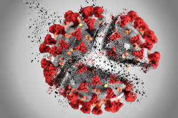

# Statistical analysis of *in vitro* inhibition of SARS-CoV-2 infection

## Original publication

In vitro screening of a FDA approved chemical library reveals potential inhibitors of SARS-CoV-2 replication. 
Franck Touret, Magali Gilles, Karine Barral, Antoine Nougairede, Etienne Decroly, Xavier de Lamballerie, Bruno Coutard. bioRxiv 2020.04.03.023846. 
[DOI 10.1101/2020.04.03.023846](https://doi.org/10.1101/2020.04.03.023846)

## Analysis results

- [**Detailed report and links to the result tables**](reports/Touret_2020_sars-cov-2_in-vitro-screening.html)

## Links to the main documents

| Doc | URL |
|------------------------|------------------------------------------------|
| bioRxiv article | <https://www.biorxiv.org/content/10.1101/2020.04.03.023846v1> |
| Supplementary tables | <https://www.biorxiv.org/content/biorxiv/early/2020/04/05/2020.04.03.023846/DC1/embed/media-1.xlsx?download=true>|
| Github repository | <https://github.com/jvanheld/touret_sars-cov-2_inhibitors> |
| Web pages | <https://jvanheld.github.io/touret_sars-cov-2_inhibitors/> |
| Analysis report | [html](reports/Touret_2020_sars-cov-2_in-vitro-screening.html) [pdf](reports/Touret_2020_sars-cov-2_in-vitro-screening.pdf) [Rmd](https://raw.githubusercontent.com/jvanheld/touret_sars-cov-2_inhibitors/master/reports/Touret_2020_sars-cov-2_in-vitro-screening.Rmd) |

********************************

Alice van Helden. (2020). Covid-19 cracked. Zenodo. http://doi.org/10.5281/zenodo.3734643

********************************
